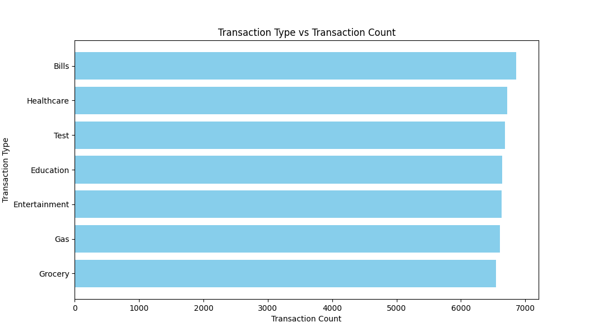
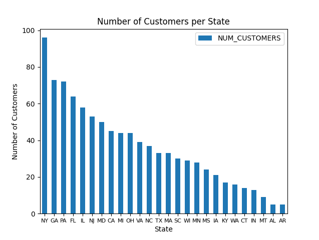
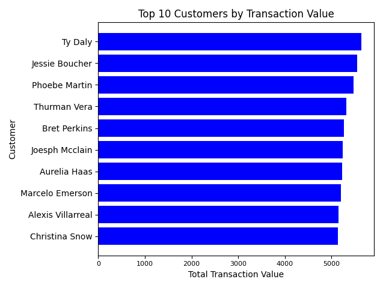
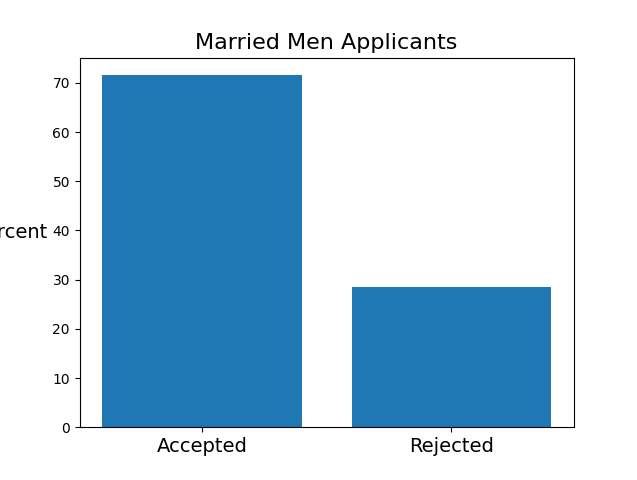
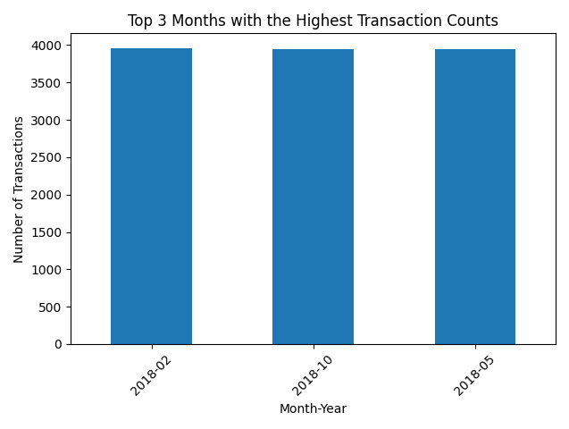
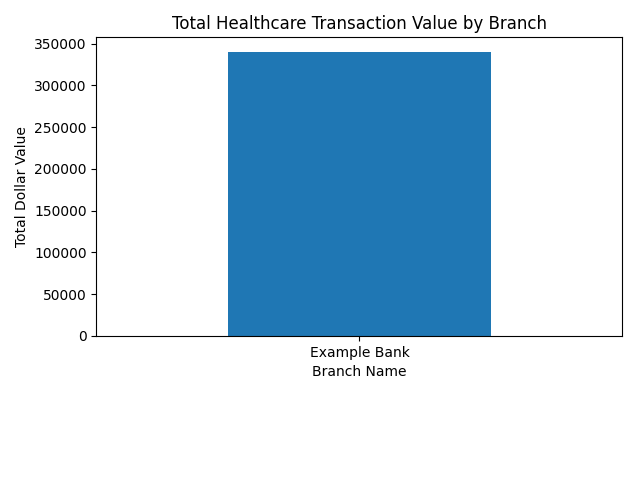

# Capstone

# PerScholas Capstone Banking Project

## Overview

This project reads in json files and also an API which utilizes a console to display data. Uses Transaction and Customer data
using various technologies to produce visualizations.

## Libraries and Technologies used include:

These imports json, mysql connector, pandas, matplotlib

## Features

### Transaction Data
Describe with the project is doing
### Transaction Data Options

### Customer Data

### Customer Data Options

## Additional Visualizations

- 
- 
- 
- 
- 
- 
- 

