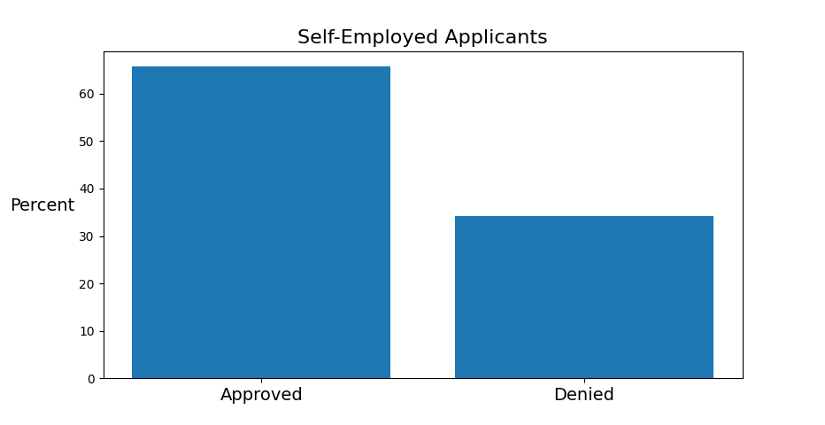

# Capstone

Used the following command to create the requirments file from the command line at the capstone directory
pip freeze > requirements.txt

Link with information on how to create and style a readme file
https://docs.github.com/en/get-started/writing-on-github/getting-started-with-writing-and-formatting-on-github/basic-writing-and-formatting-syntax

