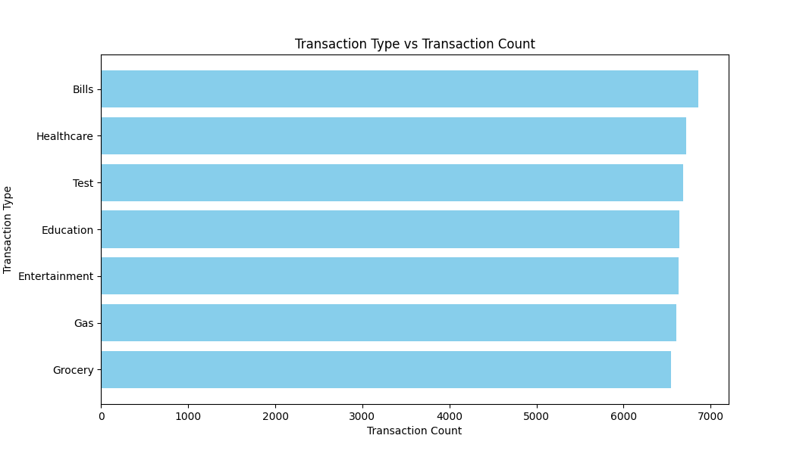
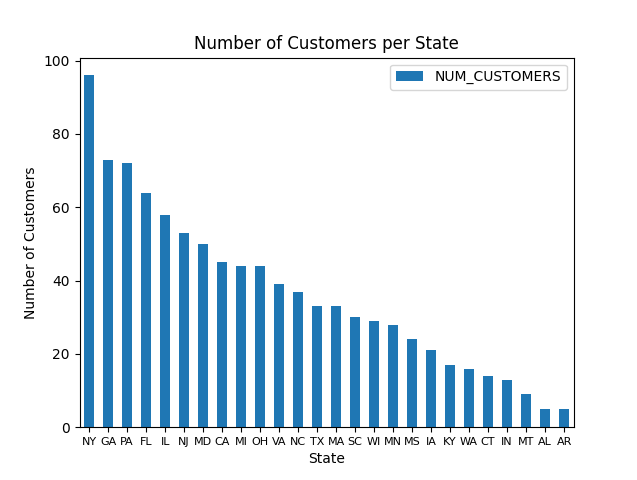
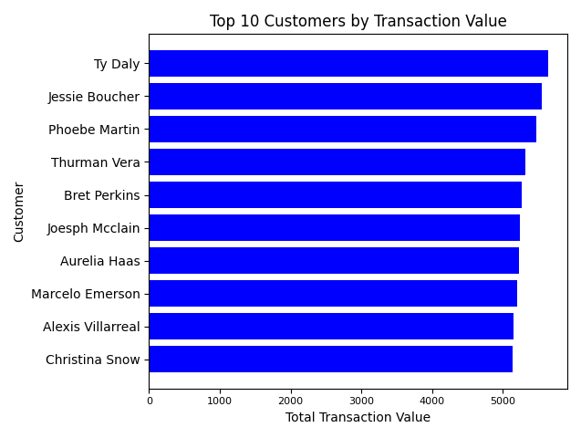
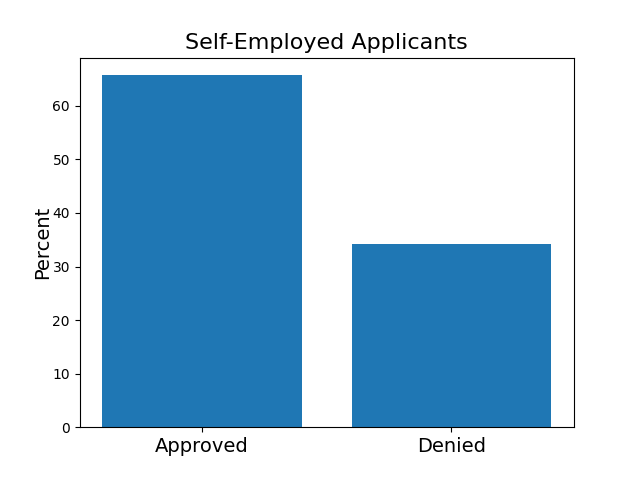
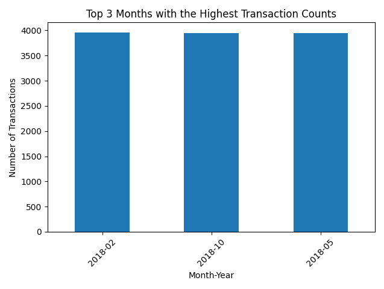
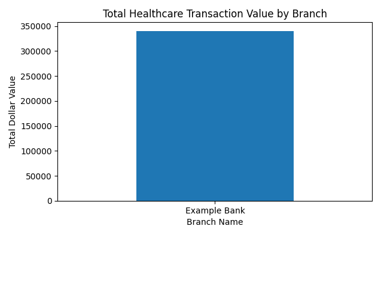

# Capstone

# PerScholas Data Engineering - Capstone Banking Project

## Overview
This Capstone Project utilized technologies to manage an ETL process for a Loan Application and Credit Card datasets. Python
and modules like Pandas and Matplotlib were also utilized. As well as SQL and Apache Spark, for data analysis and selection.

This project reads in json files and also an API which then utilizes a console to display data based on the users desires.
Transaction and Customer data using various technologies are used to produce a result set and visualizations.

## Libraries and Technologies used include:
Imports include: JSON, mysql connector, pandas, matplotlib...
See Requirements for a complete list.

## Features
The python program interface is run at the terminal. The customer is presented with selection options to choose from.
Database updates by the customer in realtime are also featured.

### Transaction Data
Three JSON files
API Endpoint Dataset

### Transaction Data Options/Customer Data Options
See the github documentation associated with this project

## Visualizations

- 
- 
- 
- 
- 
- 
- 